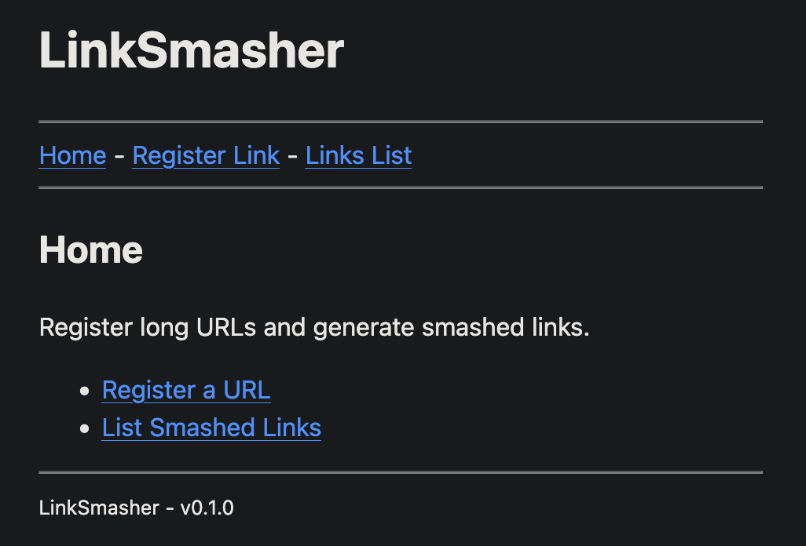

* Link-Smasher

A self-hosted URL shortener written in Common Lisp (SBCL). Paste a long URL,
get a short link back. Visitors are automatically redirected after a configurable
delay.

** Screenshot

** Tech Stack

- SBCL (Steel Bank Common Lisp)
  - Hunchentoot: web server
  - Easy-Routes: routing
  - Djula: HTML templates
- SQLite3: single-file database

** Pre-Install

*** The Quicklisp way

Automatically installs all dependencies and loads the project.

#+BEGIN_SRC lisp
(load "~/quicklisp/setup.lisp")
(pushnew (uiop:getcwd) ql:*local-project-directories*)
(ql:quickload :link-smasher)
#+END_SRC

*** The ASDF way

Load the project assuming all dependencies are already installed.

#+BEGIN_SRC lisp
(pushnew (uiop:getcwd) asdf:*central-registry*)
(asdf:load-system :link-smasher)
#+END_SRC

** Building

Build a standalone executable:

#+BEGIN_SRC sh
make build
#+END_SRC

** Running

*** From source (development)

Requires Quicklisp.

#+BEGIN_SRC sh
make run
#+END_SRC

*** From the built binary

#+BEGIN_SRC sh
make run-bin
#+END_SRC

*** Directly

#+BEGIN_SRC sh
./link-smasher --port 3800 --db db.sqlite3 --base http://localhost:3800/ --seconds 3
#+END_SRC

Or via environment variables:

#+BEGIN_SRC sh
PORT=3800 DB=db.sqlite3 BASE_URL=http://localhost:3800/ SECONDS=3 ./link-smasher
#+END_SRC

** CLI Options

| Flag          | Env var  | Default                | Description                      |
|---------------+----------+------------------------+----------------------------------|
| =-p=, =--port=    | =PORT=     | =3800=                   | Web server port                  |
| =-d=, =--db=      | =DB=       | =db.sqlite3=             | Path to SQLite database file     |
| =-b=, =--base=    | =BASE_URL= | =http://localhost:3800/= | Base URL used in generated links |
| =-s=, =--seconds= | =SECONDS=  | =3=                      | Seconds before redirect          |
| =-h=, =--help=    |          |                        | Show help                        |
| =-v=, =--version= |          |                        | Show version                     |

** Make Targets

| Target    | Description                              |
|-----------+------------------------------------------|
| =build=     | Build standalone executable              |
| =run=       | Run from source (requires Quicklisp)     |
| =run-bin=   | Run the built executable                 |
| =install=   | Install binary to =/usr/local/bin=         |
| =uninstall= | Remove binary from =/usr/local/bin=        |
| =clean=     | Remove build artifacts and FASL cache    |
| =repl=      | Start SBCL REPL with link-smasher loaded |
| =check=     | Check code compiles without running      |
| =help=      | Show Makefile help                       |

** Usage

1. Open =http://localhost:3800/= in your browser.
2. Go to *Register Link* and paste a URL.
3. Copy the short link from the result page.
4. Share it: visitors will be redirected to the original URL after the configured delay.
5. View all registered links at =/list=.
